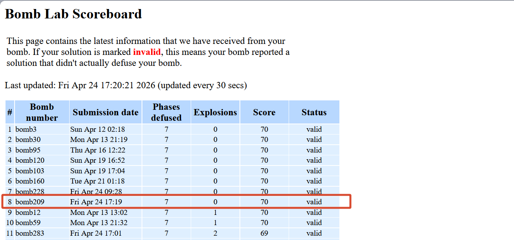
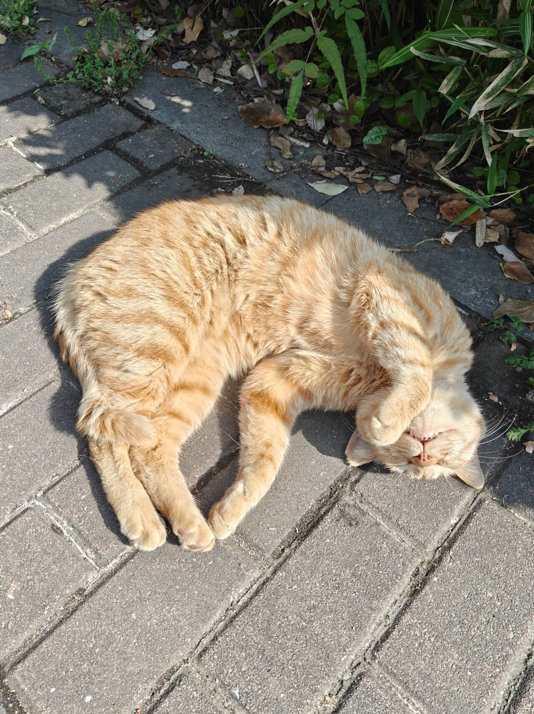

+++
date = '2026-04-25T20:19:28+08:00'
draft = false
title = 'Boomlab'
showLikes = true
tags = ["杂谈","diary"]
+++

## 大橘为重

封面好看吧，上周五跑完2000m后，回宿舍的路上看到的，感谢大橘老师自愿出镜

## boomlab

昨天总算把折腾两天的Bomblab实验做完了，实验报告也写了，来做个小结吧

先说结果，这次拿到了满分70分，而且没有任何失败扣分的情况，截图在这里

整体来说难度很简单，我全程自己读汇编，读伪c代码做的，具体的操作过程可以看[这里](https://docs.yo1o.top/docs/study/homeworks/cs/boomlab)

有点点小想法，很久没有体会到初学ctf的时候，解决硬磕很久很久的题目的那种快感了，这次就有那种感觉，感觉不错

然后针对这次实验，我发现下次再逆向这样的简单题目的时候，不要再想当然跳过一些函数了，还好有老师提醒，不然我都不知道这里还有隐藏关卡

## 一些对未来的计划

原计划这个暑假出去实习，下学期开始准备考研，但是和朋友聊了很久，他们说如果我想好要读研了，那么这个假期真的没必要再去实习，就短期来看，没有任何帮助，倒不如再玩玩？

哈哈，他们的这个建议我还是听进去了，确实，就两三个月的实习经历貌似确实没有必要？我觉得倒不如趁假期的时候多读读论文，跟导师做做项目，然后可以开始准备我自己的毕设了，偷偷泄露点，我打算设计一个agent框架，具体的就不能再说了哈

然后今天看到Samsara小姐姐在三亚玩拍的照片，真的好美，那边景色真的好漂亮，作为一个北方人，我确实没有见过真正的大海，我想好了，暑假如果不回家的话，嗯，一定要去海边玩玩，要旅游！！！

最后的最后，补上大橘老师的另一张照片吧

> oi，大橘老师，能不能起来重睡呢？哈哈哈

