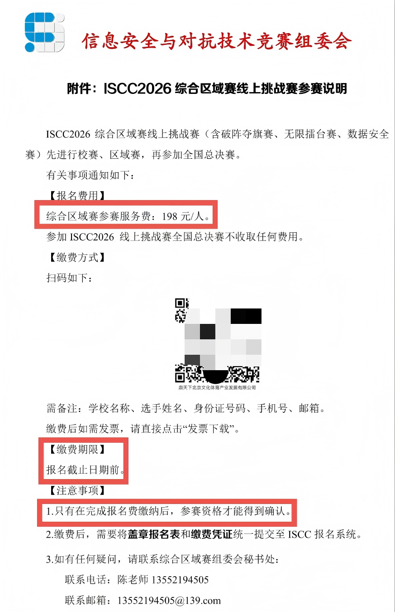

+++
date = '2026-04-22T17:20:00+08:00'
draft = false
title = 'Datalab'
showLikes = true
tags = ["杂谈","diary"]
+++

## 翘课真的是个意外

今天天气阴（旁外话就是太适合睡觉了，至于谁翘了一节计算机系统课我就不说了

## 完成了一份实验

然后今天把这学期的计算机系统课的实验一完成了，这是我写的[实验过程链接](https://docs.yo1o.top/docs/study/homeworks/cs/datalab/)

我的天，关于浮点数的处理难死我了，好在最后草稿纸上画画摸索出来了

## 换个卡

时间过得真快，高考后的那个暑假，我办理了一张校园卡，md，那个办卡的学长真坑人，明明40的那档足够我用了，但是他哄我60的有多好有多好，无语

这个月底，这张校园卡两年套餐会到期，趁这个移动给新生办卡的机会，我找人帮我办理了40的那档，嗯，舒服

## 想吐槽下

在3月多吧，我就在准备今年ISCC了，预计这会是我本科期间打的最后一场CTF了，现在的ctf氛围越来越差劲，再也体会不到刚学ctf的时候，一个人在电脑前提交flag后排名库库上升的喜悦了

原本打算在这次iscc上好好发挥，争取打进线下，很想和一些师傅面基，去外地稍微旅旅游，但是昨天iscc官方发布了一份公告，大致内容如下：

逆天，iscc居然开始圈钱了，还说收取的报名费仅仅是区域赛的缴费，只要校赛晋级就能打国决赛，可是注意事项里居然说只有报名费用缴纳后才能参赛，omg，这么相悖的事发生了，乐，我是暂时没想到方法能跳过区域赛，直接打校赛和国决

其实198也许不是特别高吧？但是结合往年固定节目：pycc，这次更是收取了报名费用，那些py等行为估计会更加严重泛滥，再加上那些氪金用最顶级模型的参赛选手，我不太认为自己能在这场赛事上凭自己的能力拿到奖

既然这样，那就不捐钱咯

唉，还得抽时间给我的导师解释下为啥搞到报名表了，我还不打这场比赛（因为一些原因(反正不赖我，被别人被刺了)，我不再是校队的了，就无法直接用校队的章来报名一些只能校队身份打的比赛，为了这次iscc，我找了一位导师，让他帮我找到了学校的章，才能完善这个报名表

> 这两天有这样的一个想法：在这个被ai渗透在方方面面的时代，我反而更希望生活节奏能慢一点，每次在ai的辅助下完成某些任务，我总感觉有一种不真实感，我是谁，我在哪，我刚刚干了什么，就这样浑浑噩噩的干完一个又一个任务，总感觉没有记忆，这样的错觉我感觉也许不止我一个人吧，哈哈，所以说啊，慢点，稍微慢一点就好

