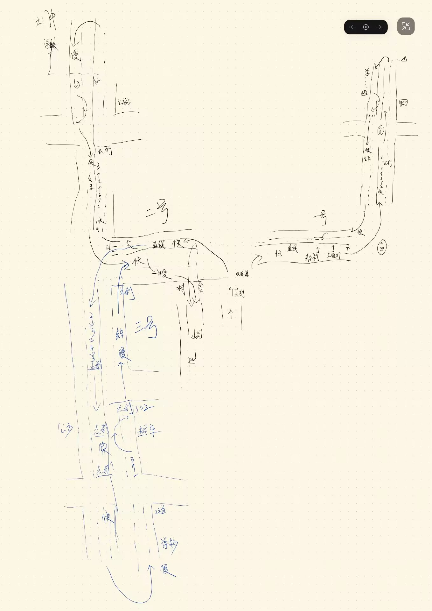
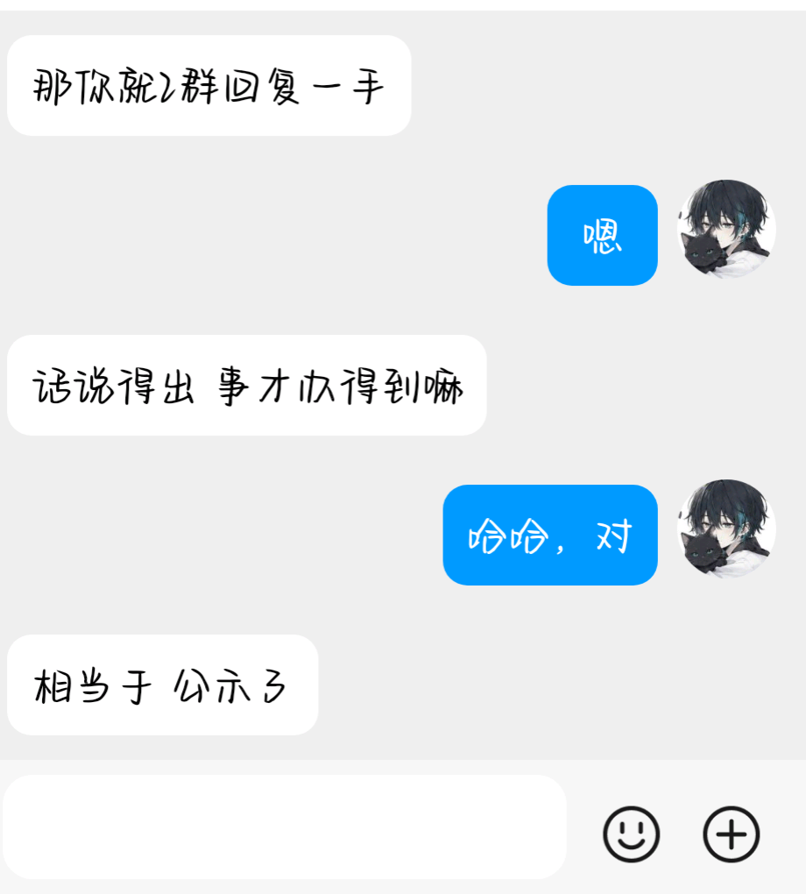

+++
date = '2026-07-23T13:04:19+08:00'
draft = false
title = 'Recently(2026-7-23)'
showLikes = true
tags = ["总结","杂谈"]
+++

## emo

现在想想，是真的真的好后悔在家这里学驾照，学车经历太曲折了

科二倒是没啥说的，蛮简单，一次性满分过的

科三就太折磨我了，顶着大太阳练车都是小事，主要是有的教练太坏了，应该是大二上的那个寒假，我第一次去C1二组报道，学习科三，坏蛋教练啥也不教，我看轮到我了，就上了车，寻思着他应该能在我练车的时候进行指点，结果由于不太清楚训练场地的路线，那坏蛋就开始不断的骂我，说我进群了，为啥不看视频(这教练提前录制了考试线路上的视频，但是细节部分并没有讲到，而且是一两个小时前发的，我还没有看呢)，还骂我啥也干不成，连挂挡换挡都做不到位(科二一直是一档+离合，我当时并不会加减档位)，我真的无语了，他还啥也没教呢，哪来脸说这些，那天晚上越想越气，回到家后给我妈妈说了这事(当时我妈妈是驾校的教练，后来辞职了)，我妈妈当时也询问了这个教练具体经过，他编的还好，美名其曰为了教导让我快速学会科三，不过当时我真的很生气，那个寒假就再没去练过车

时间来到大二下暑假，也就是这个假期，我寻思都过了半年，那坏蛋能好好教导我了吧，我上车前态度放的很低很低了，当时我的原话是，“教练好，这是我第一次跑全程，辛苦你多指点两句”，那坏蛋好像听不见一样，啥也没说，我当他默认了，上车后，他就开始不当人了，又开始无缘无故骂我，并且还拿我之前寒假向我妈妈告状的事情指指点点，我真的真的忍不住了，开始好好的和它说：“我们不谈去年的事情了吧，就说今年的，我保证好好学”，那坏蛋不依不饶，最后这次练车也没练出什么名堂，毕竟它也不讲，我开车下去掉了个头就练车结束了

思考了很久，我感觉我应该没招他惹他才对，不知道它发什么神经，总之我是一点也不想跟它练了，很想来到大学旁边的驾校里学，毕竟有同学陪，而且那里的教练应该不会这么抽象，第二天我自己去驾校里的业务大厅，联系相关工作人员，想了解下转驾校的要求是什么，需要准备哪些材料，这个时候校长出来了，问了我为啥想转，我就大致的说了下原因：这教练不给我教，就知道骂人，我不能花钱过来受气吧。后来，在校长和科二的一个教练的安排下，我换组来到一组学习科三，开车的时候，一旁的教练会到考核点处给我报点，这是真的爽啊，我哪里做的不太对了，他也会指出来让我纠正，这下我就放下心来，踏踏实实练了一周科三，一直到今天考试，又一个巨大的滑铁卢砸向了我。。。

昨晚真的是准备很充分了，在自家车里练了两把灯光模拟，然后手绘了第二天考试可能会抽到的所有路线(共三条，路线草图如下)

考试的时候，我被分到了四号车上，这车就和平时练车用的教练车差距有点大，不过我还是马上适应上手了。灯光模拟、起步什么的，这些项目都是满分没问题的，结果连续两次挂在了直线行驶上，这对我来说，真的真的太冤枉了，我和往常练车一样，进行正常的直线行驶，似乎是因为我的方向盘不能做到绝对静止？莫名其妙的挂了，两次都是如此，下车后和教练聊这个，教练却说是我的运气不好，大致缘由如下：

驾校为了压及格率(我不太理解为啥要压)，会随机抽人，我就是那个倒霉蛋，然后后台那些考官逐帧看我的行驶过程，换句话说就是找茬，我真的好难受啊，这找茬就不能在一些吃操作的项目里找茬吗？直线行驶是起步后的第一个简单项目，我把车身调整好后，就啥也不用管，踩油门就行了啊，真的好冤枉哎

唉，这个假期学车让我好难受，心态也属于是↘️↗️↘️↘️↘️↘️↘️，罢了，等8月份交钱再考一次吧，也许到了那会儿，我的运气会涨点

> 喜提10天冷静期，可是我真的很难冷静下来！！！

## some plans

假期从7.2开始的，唉，都快浪费一个月了，后面剩余时间，我一定要珍惜，让这个假期含金量高点，就像渗透群群主老大说的，公示出来，读者可以监督哦，等假期结束，我会写篇总结的

- Prism_Agent
  - 这是我这个假期着重要开发出来的渗透编排Agent，打算让它作为我的毕设，这样大四我就能考完研直接出去happy和实习打工了
- 刷渗透靶机
  - 我的渗透知识依然有点贫瘠，这个假期一定要多多打靶机进行练习，毕竟大三就要收心了，这个假期要一次性打爽
- 吉他练习
  - 我用上学期的比赛奖金和奖学金什么的，除去给家人买礼物，剩下一点被我用来买了吉他，这个假期很想自学入门（幻想时刻：自学成才，然后成为别人眼里多才多艺的秀儿

